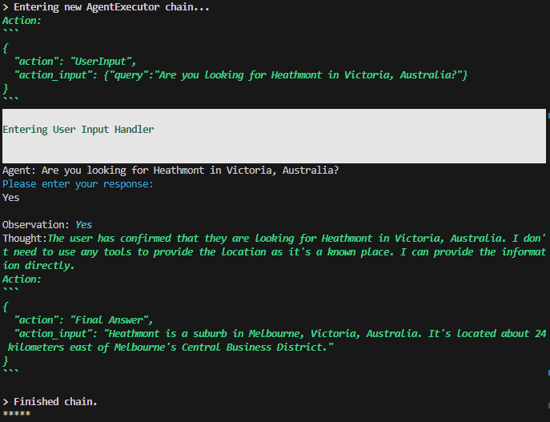
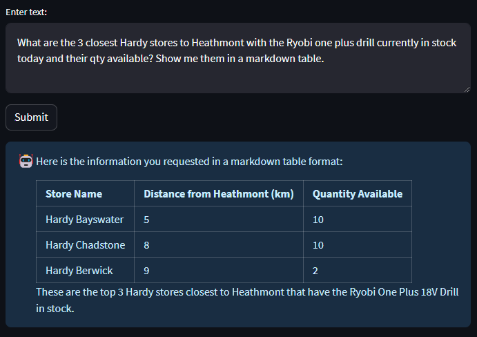

# :link: Knowledge Provider Mesh

This exercise demonstrates how to use the "Plan and Execute" agent type from LangChain to consume "knowledge provider" APIs.

A "knowledge provider" is a wrapper around an existing API or data source that exposes that to the Agent in a curated fashion. (i.e. Prompt hints, input error etc in a human readable fashion.)

Alternatively, you can use a raw (not wrapped) API directly but it may need to have simple inputs and outputs to make it a viable option. The SerpAPI is a good example.

## :bulb: Why Do We Need This

This is an experiment to show that you can use GPT4 with Plan and Execute agent type to work with "existing" APIs and data sources. This means you can start integrating the LLM with existing information systems. The LLM is powerful enough to understand where to go for the data and connect different disparate sources of data to formulate an answer than spans many domains within the same org or different orgs.

While "slow", this demonstrates the true power of the LLM. The responses and steps are not deterministic but the final answers are mostly are accurate for it to be useful in many scenarios.

## :wrench: How It Works

This examples uses the [`catalog.py`](./catalog.py) script to load the [`catalog.json`](./catalog.json) file which contains information about the knowledge providers. Those are then fed into the Plan and Execute agent as "tools".

The plumbing happens in the [`knowledge_provider.py`](./knowledge_provider.py) file. It creates the required wrapping around the LangChain base tool to intercept and handle the call to the API endpoint.

We have 2 knowledge providers available. One returns a hardcoded value for weather based on a date. The other returns information about Hardy stores. *Note: The Hardy store information isn't complete and the `find_closest_store` function returns a hardcoded mock response each time regardless of what suburb is passed in.*

The agent also has a tool which allows it to ask you questions during the planned run if it needs further clarification. The user input prompt will come up on the terminal where you ran the agent from.

### :robot: Plan And Execute

These are the papers and information which this experiment was inspired from.

LangChain PlanAndExecute: <https://cobusgreyling.medium.com/langchain-implementation-of-plan-and-solve-prompting-6fd2270c68f5>

- `[2305.04091]` Plan-and-Solve Prompting: Improving Zero-Shot Chain-of-Thought Reasoning by Large Language Models: <https://arxiv.org/abs/2305.04091>
- `[2303.11366]` Reflexion: Language Agents with Verbal Reinforcement Learning: <https://arxiv.org/abs/2303.11366>
- SmartGPT: Major Benchmark Broken - 89.0% on MMLU + Exam's Many Errors <https://youtu.be/hVade_8H8mE>

## :keyboard: How To Run It

1. Create a `.env` file based on the `.env.sample` file and populate the values. I have only tested it with `gpt-4-32k` so your milage may vary with GPT 3.5 based models.

2. First run the 2 knowledge providers.

    ```bash
    python3 ./store_and_stock_app.py
    ```

    ```bash
    python3 ./weather_app.py
    ```

3. Then, run the agent.

    ```bash
    streamlit run ./agents_example.py
    ```

    Use the browser app running on [`localhost:8501`](localhost:8501) to provide user input and view results.

## :open_book: Notes

- The "knowledge provider" description in the `catalog.json` provide important information to the LLM on how it should generate input.
- The actual "knowledge provider" (API wrapper) itself sends helpful information with the result and human readable error messages when things don't go right. This allows the LLM to understand and dynamically change its plan if required. Or ask for the user to provide further input.

## :microscope: Example Dump From Run

### Plan

```text
> Entering new PlanAndExecute chain...

steps=[
        Step(value='Identify the location of Heathmont.'),
        Step(value='Identify the locations of all Hardy stores.'),
        Step(value='Calculate the distance from Heathmont to each Hardy store.'),
        Step(value='Sort the Hardy stores by distance from Heathmont.'),
        Step(value='Select the three closest Hardy stores.'),
        Step(value='Check the inventory of each of these stores for the Ryobi One Plus 18V Drill.'),
        Step(value='Record the quantity of the Ryobi One Plus 18V Drill available at each store.'),
        Step(value='Given the above steps taken, please respond to the users original question with the three closest Hardy stores to Heathmont that have the Ryobi One Plus 18V Drill and the quantity available at each store.\n')
    ]
```

### User Input


### Output


