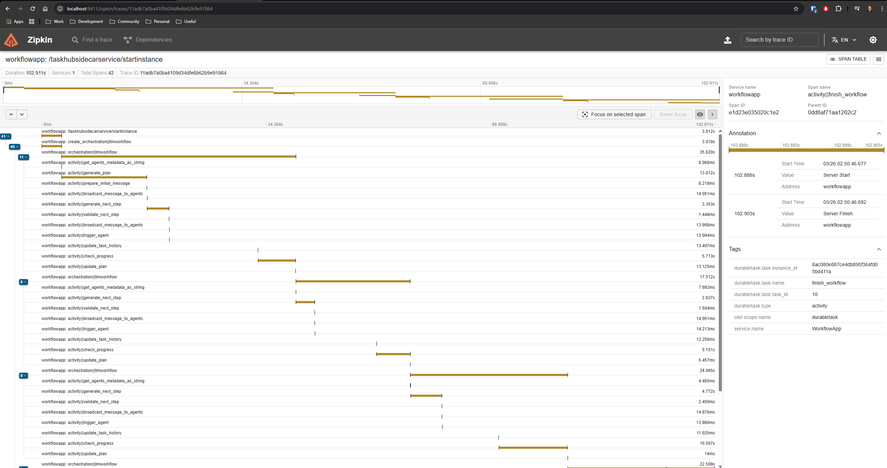

# Multi-Agent Event-Driven Workflows
This quickstart demonstrates how to create and orchestrate event-driven workflows with multiple autonomous agents using Dapr Agents. You'll learn how to set up agents as services, implement workflow orchestration, and enable real-time agent collaboration through pub/sub messaging.

## Prerequisites
- Python 3.10 (recommended)
- pip package manager
- AzureOpenAI API key
- Dapr CLI and Docker installed

## Environment Setup

```bash
# Create a virtual environment
python3.10 -m venv .venv

# Activate the virtual environment
# On Windows:
.venv\Scripts\activate
# On macOS/Linux:
source .venv/bin/activate

# Install dependencies
pip install -r requirements.txt
```

## Configuration

1. Create a `.env` file based on the env.sample file:

```env
AZURE_OPENAI_API_VERSION="2024-08-01-preview"
AZURE_OPENAI_API_KEY=""
AZURE_OPENAI_ENDPOINT=""
AZURE_OPENAI_DEPLOYMENT="gpt4o"
AZURE_OPENAI_MODEL_NAME="gpt-4o"
```

2. Make sure Dapr is initialized on your system:

```bash
dapr init
```

3. The quickstart includes the necessary Dapr components in the `components` directory:

- `statestore.yaml`: Agent state configuration
- `pubsub.yaml`: Pub/Sub message bus configuration
- `workflowstate.yaml`: Workflow state configuration

## Project Structure

```
components/               # Dapr configuration files
├── statestore.yaml       # State store configuration
├── pubsub.yaml           # Pub/Sub configuration
└── workflowstate.yaml    # Workflow state configuration
services/                 # Directory for agent services
├── catalog/              # Catalog agent's service
│   └── app.py            # FastAPI app for catalog
├── stock/                # Stock agent's service
│   └── app.py            # FastAPI app for stock
├── stores/               # Stores agent's service
│   └── app.py            # FastAPI app for stores
└── workflow-llm/         # LLM orchestrator
    └── app.py            # Workflow service        
dapr-llm.yaml             # Multi-App Run Template using the LLM orchestrator
```

## Examples

### Agent Service Implementation

Each agent is implemented as a separate service. Here's an example for the Catalog agent:

```python
from dapr_agents import AssistantAgent, tool
from dapr_agents.llm.openai.chat import OpenAIChatClient
from dotenv import load_dotenv
import asyncio
import logging
import os
import requests
from pydantic import BaseModel, Field

# Catalog API Calls
@tool()
def call_get_catalog() -> str:
    # Implementation of API call to get catalog data
    # ...

async def main():
    try:
        llm = OpenAIChatClient(
            api_key=os.getenv("AZURE_OPENAI_API_KEY"),
            azure_endpoint=os.getenv("AZURE_OPENAI_ENDPOINT"),
            azure_deployment=os.getenv("AZURE_OPENAI_DEPLOYMENT"),
            api_version=os.getenv("AZURE_OPENAI_API_VERSION")
        )
        
        catalog_service = AssistantAgent(
            name="CatalogAgent",
            role="CatalogManager",
            goal="Provide product catalog information including item descriptions and item codes.",
            instructions=[
                "You are a catalog agent.",
                "You provide product information using the tools specified below.",
                "You can only make one request at a time.",
                "You only have the get_catalog, get_item_description and find_item tools."
            ],
            tools=[
                call_get_catalog,
                call_get_item_description,
                call_find_item
            ],
            llm=llm,
            message_bus_name="messagepubsub",
            state_store_name="workflowstatestore",
            state_key="workflow_state",
            agents_registry_store_name="agentstatestore",
            agents_registry_key="agents_registry",
            service_port=8001,
        )

        await catalog_service.start()
    except Exception as e:
        print(f"Error starting service: {e}")

if __name__ == "__main__":
    load_dotenv()
    logging.basicConfig(level=logging.INFO)
    asyncio.run(main())
```

Similar implementations exist for the Stock and Stores agents.

### Workflow Orchestrator Implementation

The LLM-based orchestrator manages the interaction between agents by intelligently selecting which agent should handle each task:

```python
from dapr_agents import LLMOrchestrator
from dapr_agents.llm.openai.chat import OpenAIChatClient
from dotenv import load_dotenv
import asyncio
import logging
import os


async def main():
    try:
        llm = OpenAIChatClient(
            api_key=os.getenv("AZURE_OPENAI_API_KEY"), # or add AZURE_OPENAI_API_KEY environment variable to .env file
            azure_endpoint=os.getenv("AZURE_OPENAI_ENDPOINT"), # or add AZURE_OPENAI_ENDPOINT environment variable to .env file
            azure_deployment=os.getenv("AZURE_OPENAI_DEPLOYMENT"),
            api_version=os.getenv("AZURE_OPENAI_API_VERSION")
        )
        workflow_service = LLMOrchestrator(
            name="LLMOrchestrator",
            message_bus_name="messagepubsub",
            state_store_name="workflowstatestore",
            state_key="workflow_state",
            agents_registry_store_name="agentstatestore",
            agents_registry_key="agents_registry",
            service_port=8004,
            max_iterations=5,  # Increased to handle more complex queries involving multiple agents
            llm=llm,
            agent_selection_prompt="""
            You are an orchestrator that selects the best agent to handle a specific task.
            Available agents include:
            - Catalog Manager: For product information, item descriptions, and item codes
            - Stores Manager: For store locations, addresses, and finding nearby stores
            - Stock Manager: For inventory information, stock quantities, and product availability

            Select the most appropriate agent to handle each task step.
            """
        )

        await workflow_service.start()
    except Exception as e:
        print(f"Error starting service: {e}")


if __name__ == "__main__":
    load_dotenv()

    logging.basicConfig(level=logging.INFO)

    asyncio.run(main())
```

### Running the Multi-Agent System

Run all services using the Dapr CLI:

```bash
dapr run -f dapr-llm.yaml 
```

You will see the agents collaborating to process your query, with each specialized agent handling relevant parts of the task.

The `services/workflow-llm/LLMOrchestrator_state.json` file contains the current state of the workflow. You will be able to see the reasoning steps and the output from each agent there.

## Example Queries to Try

- "Find information about the Ryobi One Plus 18V Drill and check which stores have it in stock."
- "What are the 3 closest Hardy stores to Bayswater and what items do they carry?"
- "Tell me about the Osmocote Organic Fertilizer and where I can buy it."

## Example Workflow Run



```json
{
    "instances": {
        "8ac080e887ce4db895f364fd05bd411a": {
            "input": "Find information about the Ryobi One Plus 18V Drill and check which stores have it in stock.",
            "output": "### Task Summary: Ryobi One Plus 18V Drill Stock Check  \n\nWe successfully verified the stock availability of the Ryobi One Plus 18V Drill across five retail stores in the region. Here's the outcome:  \n\n- **Available Stores**:\n  - **Hardy Bayswater**: 10 units in stock  \n  - **Hardy Chadstone**: 10 units in stock  \n  - **Hardy Berwick**: 2 units in stock  \n\n- **Unavailable Stores**:\n  - **Hardy Ringwood**: No stock available  \n  - **Hardy Glen Waverley**: No stock available  \n\n### Key Steps Taken:  \n1. The product details for the Ryobi One Plus 18V Drill were retrieved from the catalog.  \n2. A list of five potential stores was identified for inventory verification.  \n3. Stock availability was confirmed, with documented quantities and status for all stores.  \n\n### Conclusion:  \nThe task is complete. If more assistance is required, such as purchasing options or further inquiries about store policies, let me know!",
            "start_time": "2025-03-25T15:49:06.795990",
            "end_time": "2025-03-25T15:50:46.685442",
            "messages": [
                {
                    "id": "5cf5f770-4118-474d-8b1b-85b50eb6f31a",
                    "role": "user",
                    "content": "## Mission Briefing\n\nWe have received the following task:\n\nFind information about the Ryobi One Plus 18V Drill and check which stores have it in stock.\n\n### Team of Agents\n- CatalogAgent: CatalogManager (Goal: Provide product catalog information including item descriptions and item codes.)\n- StockAgent: StockManager (Goal: Provide inventory stock information including availability and quantities.)\n- StoresAgent: StoresManager (Goal: Provide store information like store name and address.)\n\n### Execution Plan\nHere is the structured approach the team will follow to accomplish the task:\n\n[{'step': 1, 'description': 'Identify and retrieve product details for the Ryobi One Plus 18V Drill from the product catalog.', 'status': 'not_started', 'substeps': None}, {'step': 2, 'description': 'Determine the retail stores in the region that potentially stock the item.', 'status': 'not_started', 'substeps': None}, {'step': 3, 'description': 'Verify the availability of the Ryobi One Plus 18V Drill at each identified retail store.', 'status': 'not_started', 'substeps': [{'substep': 3.1, 'description': 'Contact each store to inquire about stock status.', 'status': 'not_started'}, {'substep': 3.2, 'description': \"Document quantities and availability as per the stores' confirmation.\", 'status': 'not_started'}]}]\n",
                    "timestamp": "2025-03-25T15:49:19.871560",
                    "name": "LLMOrchestrator"
                },
                {
                    "id": "0d80fc73-ba19-4945-9830-753ca726f0ba",
                    "role": "user",
                    "content": "Please retrieve and provide detailed product information for the Ryobi One Plus 18V Drill, specifically from the product catalog.",
                    "timestamp": "2025-03-25T15:49:23.270707",
                    "name": "LLMOrchestrator"
                },
                {
                    "id": "9cd38cf9-17b3-42e6-a58d-e379c7af97ec",
                    "role": "user",
                    "content": "The Ryobi One Plus 18V Drill product details are as follows:\n\n- **Item Name**: Ryobi One Plus 18V Drill\n- **Item Code**: RYB-DRILL",
                    "timestamp": "2025-03-25T15:49:36.816265",
                    "name": "CatalogAgent"
                },
                {
                    "id": "5bb8aa77-21b1-4e5d-9227-f3a13da3300c",
                    "role": "user",
                    "content": "Please determine the retail stores in the region that potentially stock the item.",
                    "timestamp": "2025-03-25T15:49:45.506847",
                    "name": "LLMOrchestrator"
                },
                {
                    "id": "def2e9d9-be5d-4f5f-a2ab-a079b0f90944",
                    "role": "user",
                    "content": "The following retail stores are potentially stocking products in the region:\n\n1. **Hardy Bayswater**\n   - Address: 200 Canterbury Rd, Bayswater VIC 3153\n   - Store ID: 101\n\n2. **Hardy Ringwood**\n   - Address: 123 Charter St, Ringwood VIC 3134\n   - Store ID: 102\n\n3. **Hardy Glen Waverley**\n   - Address: 1 Railway Pde, Glen Waverley VIC 3150\n   - Store ID: 103\n\n4. **Hardy Chadstone**\n   - Address: 345 Bay Rd, Chadstone VIC 3148\n   - Store ID: 104\n\n5. **Hardy Berwick**\n   - Address: 12 Bulla Rd, Berwick VIC 3806\n   - Store ID: 105\n\nNext, the team responsible for stock management will need to verify the Ryobi One Plus 18V Drill\u2019s availability in these stores.",
                    "timestamp": "2025-03-25T15:49:54.930883",
                    "name": "StoresAgent"
                },
                {
                    "id": "2717baff-f379-4a5d-815f-135dffc18bc2",
                    "role": "user",
                    "content": "Verify the stock availability of Ryobi One Plus 18V Drill at the listed retail stores.",
                    "timestamp": "2025-03-25T15:50:04.948894",
                    "name": "LLMOrchestrator"
                },
                {
                    "id": "700c3b78-fdab-4896-9d95-23b48e011ea0",
                    "role": "user",
                    "content": "Here is the detailed stock availability for the Ryobi One Plus 18V Drill (Item Code: RYB-DRILL) at the listed retail stores:\n\n1. **Hardy Bayswater** (Store ID: 101)\n   - Quantity in stock: 10\n\n2. **Hardy Ringwood** (Store ID: 102)\n   - Quantity in stock: 0\n\n3. **Hardy Glen Waverley** (Store ID: 103)\n   - Quantity in stock: 0\n\n4. **Hardy Chadstone** (Store ID: 104)\n   - Quantity in stock: 10\n\n5. **Hardy Berwick** (Store ID: 105)\n   - Quantity in stock: 2\n\nStores Hardy Bayswater, Hardy Chadstone, and Hardy Berwick have stock available for this item. Let me know if you need further assistance!",
                    "timestamp": "2025-03-25T15:50:13.612947",
                    "name": "StockAgent"
                },
                {
                    "id": "41bc07b5-c784-49d3-98fa-487bbc23a4db",
                    "role": "user",
                    "content": "Please document the confirmed quantities and availability for the listed stores in the inventory module.",
                    "timestamp": "2025-03-25T15:50:27.642163",
                    "name": "LLMOrchestrator"
                },
                {
                    "id": "907dc862-6124-431d-8708-e3e31ccea32a",
                    "role": "user",
                    "content": "Here is the documented confirmation of stock availability and quantities for the Ryobi One Plus 18V Drill (Item Code: RYB-DRILL) across the listed retail stores:\n\n1. **Hardy Bayswater (Store ID: 101)**:  \n   - Quantity in stock: **10**  \n   - Status: **Available**\n\n2. **Hardy Ringwood (Store ID: 102)**:  \n   - Quantity in stock: **0**  \n   - Status: **Unavailable**\n\n3. **Hardy Glen Waverley (Store ID: 103)**:  \n   - Quantity in stock: **0**  \n   - Status: **Unavailable**\n\n4. **Hardy Chadstone (Store ID: 104)**:  \n   - Quantity in stock: **10**  \n   - Status: **Available**\n\n5. **Hardy Berwick (Store ID: 105)**:  \n   - Quantity in stock: **2**  \n   - Status: **Available**\n\nLet me know if you need any other updates or additional details for this item!",
                    "timestamp": "2025-03-25T15:50:39.271104",
                    "name": "StockAgent"
                }
            ],
            "last_message": {
                "id": "907dc862-6124-431d-8708-e3e31ccea32a",
                "role": "user",
                "content": "Here is the documented confirmation of stock availability and quantities for the Ryobi One Plus 18V Drill (Item Code: RYB-DRILL) across the listed retail stores:\n\n1. **Hardy Bayswater (Store ID: 101)**:  \n   - Quantity in stock: **10**  \n   - Status: **Available**\n\n2. **Hardy Ringwood (Store ID: 102)**:  \n   - Quantity in stock: **0**  \n   - Status: **Unavailable**\n\n3. **Hardy Glen Waverley (Store ID: 103)**:  \n   - Quantity in stock: **0**  \n   - Status: **Unavailable**\n\n4. **Hardy Chadstone (Store ID: 104)**:  \n   - Quantity in stock: **10**  \n   - Status: **Available**\n\n5. **Hardy Berwick (Store ID: 105)**:  \n   - Quantity in stock: **2**  \n   - Status: **Available**\n\nLet me know if you need any other updates or additional details for this item!",
                "timestamp": "2025-03-25T15:50:39.271104",
                "name": "StockAgent"
            },
            "plan": [
                {
                    "step": 1,
                    "description": "Identify and retrieve product details for the Ryobi One Plus 18V Drill from the product catalog.",
                    "status": "completed",
                    "substeps": null
                },
                {
                    "step": 2,
                    "description": "Determine the retail stores in the region that potentially stock the item.",
                    "status": "completed",
                    "substeps": null
                },
                {
                    "step": 3,
                    "description": "Verify the availability of the Ryobi One Plus 18V Drill at each identified retail store.",
                    "status": "completed",
                    "substeps": [
                        {
                            "substep": 3.1,
                            "description": "Contact each store to inquire about stock status.",
                            "status": "completed"
                        },
                        {
                            "substep": 3.2,
                            "description": "Document quantities and availability as per the stores' confirmation.",
                            "status": "completed"
                        }
                    ]
                }
            ],
            "task_history": [
                {
                    "agent": "CatalogAgent",
                    "step": 1,
                    "substep": null,
                    "result": "The Ryobi One Plus 18V Drill product details are as follows:\n\n- **Item Name**: Ryobi One Plus 18V Drill\n- **Item Code**: RYB-DRILL",
                    "timestamp": "2025-03-25T15:49:36.822237"
                },
                {
                    "agent": "StoresAgent",
                    "step": 2,
                    "substep": null,
                    "result": "The following retail stores are potentially stocking products in the region:\n\n1. **Hardy Bayswater**\n   - Address: 200 Canterbury Rd, Bayswater VIC 3153\n   - Store ID: 101\n\n2. **Hardy Ringwood**\n   - Address: 123 Charter St, Ringwood VIC 3134\n   - Store ID: 102\n\n3. **Hardy Glen Waverley**\n   - Address: 1 Railway Pde, Glen Waverley VIC 3150\n   - Store ID: 103\n\n4. **Hardy Chadstone**\n   - Address: 345 Bay Rd, Chadstone VIC 3148\n   - Store ID: 104\n\n5. **Hardy Berwick**\n   - Address: 12 Bulla Rd, Berwick VIC 3806\n   - Store ID: 105\n\nNext, the team responsible for stock management will need to verify the Ryobi One Plus 18V Drill\u2019s availability in these stores.",
                    "timestamp": "2025-03-25T15:49:54.937231"
                },
                {
                    "agent": "StockAgent",
                    "step": 3,
                    "substep": 3.1,
                    "result": "Here is the detailed stock availability for the Ryobi One Plus 18V Drill (Item Code: RYB-DRILL) at the listed retail stores:\n\n1. **Hardy Bayswater** (Store ID: 101)\n   - Quantity in stock: 10\n\n2. **Hardy Ringwood** (Store ID: 102)\n   - Quantity in stock: 0\n\n3. **Hardy Glen Waverley** (Store ID: 103)\n   - Quantity in stock: 0\n\n4. **Hardy Chadstone** (Store ID: 104)\n   - Quantity in stock: 10\n\n5. **Hardy Berwick** (Store ID: 105)\n   - Quantity in stock: 2\n\nStores Hardy Bayswater, Hardy Chadstone, and Hardy Berwick have stock available for this item. Let me know if you need further assistance!",
                    "timestamp": "2025-03-25T15:50:13.618149"
                },
                {
                    "agent": "StockAgent",
                    "step": 3,
                    "substep": 3.2,
                    "result": "Here is the documented confirmation of stock availability and quantities for the Ryobi One Plus 18V Drill (Item Code: RYB-DRILL) across the listed retail stores:\n\n1. **Hardy Bayswater (Store ID: 101)**:  \n   - Quantity in stock: **10**  \n   - Status: **Available**\n\n2. **Hardy Ringwood (Store ID: 102)**:  \n   - Quantity in stock: **0**  \n   - Status: **Unavailable**\n\n3. **Hardy Glen Waverley (Store ID: 103)**:  \n   - Quantity in stock: **0**  \n   - Status: **Unavailable**\n\n4. **Hardy Chadstone (Store ID: 104)**:  \n   - Quantity in stock: **10**  \n   - Status: **Available**\n\n5. **Hardy Berwick (Store ID: 105)**:  \n   - Quantity in stock: **2**  \n   - Status: **Available**\n\nLet me know if you need any other updates or additional details for this item!",
                    "timestamp": "2025-03-25T15:50:39.276121"
                }
            ]
        }
    }
}
```

## Key Concepts
- **Agent Service**: Stateful service exposing an agent via API endpoints with independent lifecycle management
- **Pub/Sub Messaging**: Event-driven communication between agents for real-time collaboration
- **State Store**: Persistent storage for both agent registration and conversational memory
- **Workflow Orchestration**: Coordinating agent interactions in a durable and resilient manner
- **Tool Use**: Agents' ability to invoke external functions and APIs to accomplish specific tasks, with execution details visible in workflow state files

## Monitoring and Observability
1. **Console Logs**: Monitor real-time workflow execution and agent interactions
2. **Dapr Dashboard**: View components, configurations and service details at http://localhost:8080/
3. **Zipkin Tracing**: Access distributed tracing at http://localhost:9411/zipkin/
4. **Dapr Metrics**: Access agent performance metrics via (ex: CatalogApp) http://localhost:6001/metrics when configured

## Next Steps

After completing this quickstart, you can:

- Add more agents to the workflow
- Extend agents with custom tools
- Deploy agents and Dapr to a Kubernetes cluster. For more information on read [Deploy Dapr on a Kubernetes cluster](https://docs.dapr.io/operations/hosting/kubernetes/kubernetes-deploy)
- Check out the [Cookbooks](../../cookbook/)

## Known Issues

- If you run into weird issues with "state" try running the `make reset_dapr` command.
- The [Dapr `@tool` decorator](https://github.com/dapr/dapr-agents/blob/main/quickstarts/03-agent-tool-call/weather_tools.py) doesn't seem to work well with async methods.

